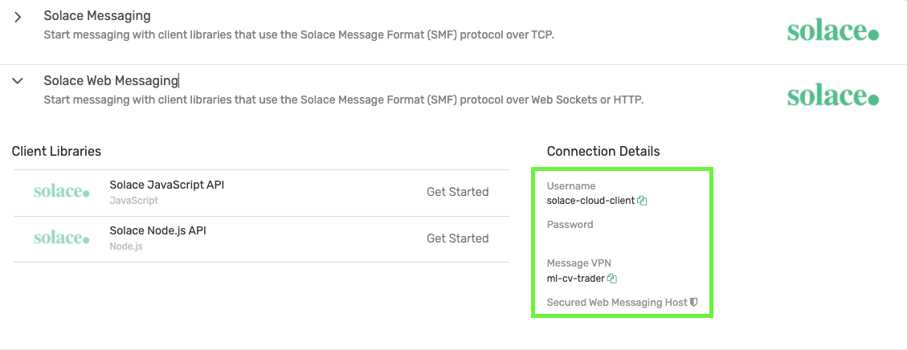

# GraphQL Server Subscription With Solace PubSub+

This application demonstrates a GraphQL Subscription Pattern implemented over Solace PubSub+ using a sample Books API. To get this up and running, you will need the following:

## Setup a Solace Cloud Event Broker

To get started with the Solace PubSub+ Event Broker - you can sign up for a [FREE Solace Cloud SaaS](https://console.solace.cloud/login/new-account) account or you can [download](https://solace.com/products/event-broker/software/getting-started/) the broker.

## Configuring the GraphQL PubSub Engine to talk to the Solace PubSub+ Event Broker

If you've used the self deployed broker, the configuration options should remain as is in the `/src/index.ts` file:

```
let pubSubOptions = new SolacePubSubOptions();
pubSubOptions.url = 'ws://127.0.0.1:8008'; //Change this to your websocket/secure websocket host
pubSubOptions.vpnName = 'default'; //Change this to your solace vpnName
pubSubOptions.userName = 'default'; //Change this to your solace username
pubSubOptions.password = 'default'; //Change this to your solace password
```


If you've signed up for a Solace Cloud Account, you would need to grab the connection details/credentials from the Solace Cloud Connect tab:



## Starting the server

Run `npm run start` which will start your GraphQL server on http://localhost:4000/graphql


## Creating a subscription

Run the following operation on the GraphQL server:

```
subscription BookCreated {
  bookCreated {
    title
    author
  }
}
```

This will create subscription on the GraphQL server.

And you can use the following operation to trigger a publish event:

```
mutation addBook {
  addBook(title: "Fox in Sox", author: "Dr. Seuss") {
    title
    author 
  }
}
```